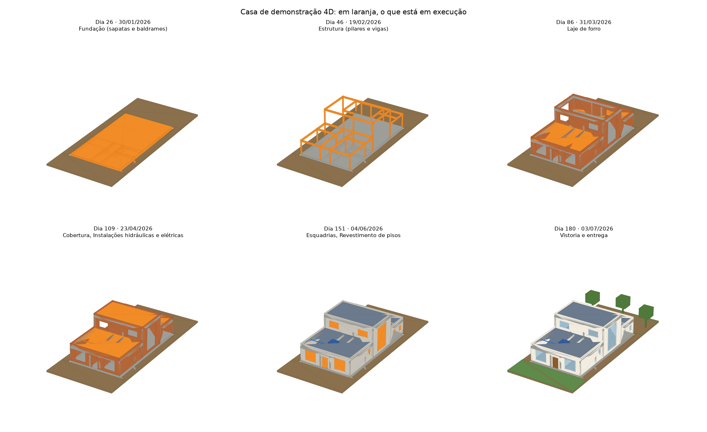

# Dani: Construction 4D Studio

*Produtor de Vídeos das obras da Super Influencer Dani, a engenheira.*

Aplicação web estática que transforma um modelo de residência (IFC) e o cronograma da obra numa simulação 4D navegável: a casa surge etapa por etapa, dia a dia. Tudo é processado no navegador; nenhum arquivo sai do dispositivo.

**Estado:** incrementos 1 a 9 implementados:
- IFC → 3D → cronograma → mapeamento → timeline → simulação 4D;
- quatro modos de animação, presets e roteiro de câmera, e geração de vídeo real;
- projetos salvos no navegador, arquivo `.4dstudio`, cronograma em XLSX, edição de tarefas e modo paramétrico;
- acompanhamento da obra: planejado × real, fotos na timeline e na simulação, planta sobreposta, relatório PDF e modelos de arquivo para download;
- revelação progressiva da obra (padrão) e vídeo pronto para compartilhar: MP4 para WhatsApp, MP4 1080p, WebM, GIF e quadros PNG;
- cronograma estimado automaticamente (§13) e tarefas por pavimento;
- aparência realista (padrão) na tela, no vídeo e no relatório: texturas de tijolo, reboco, pintura, concreto, telha, madeira e porcelanato, sol com sombras, reflexos e sombreamento nos cantos (GTAO);
- dias úteis na estimativa pelo calendário oficial do Ceará e da Região Metropolitana de Fortaleza (feriados de 2026 a 2030 no banco local);
- drone: voo manual e automático por dentro e por fora da obra enquanto ela é montada; com a obra pronta e humanizada (mobília e pessoas), volta pelas fachadas, entrada pela porta, subida e descida da escada; também como câmera do vídeo;
- céu físico com nuvens, chão até o horizonte com grama e solo fotográficos (Poly Haven, CC0), cava da fundação e árvores.

Ficam para depois (`[FUTURO]` na [especificação](docs/especificacao.md)): IA e multiusuário. PWA foi descartado.



## Instalar e executar

Requer Node.js 20.19+ ou 22.12+.

```bash
npm install
npm run dev        # servidor de desenvolvimento em http://localhost:5173
npm run build      # verifica os tipos e gera dist/
npm run preview    # serve o build em http://localhost:4173
```

Testes:

```bash
npm test                          # unidade, câmeras, animação e leitura de IFC (Vitest, Node, fuso America/Fortaleza)
npx playwright install chromium   # uma vez
npm run e2e                       # aceitação no Chromium (usa o build); os testes de vídeo usam o ffprobe
npm run tudo                      # os três em sequência
npm run modelos                   # regenera public/modelos (o exemplo.4dstudio é montado pelo próprio app)
```

## Publicar

**No ar:** https://marceloclr.github.io/dani/ (publicado a cada push na `main` por `.github/workflows/pages.yml`, que roda os testes e o build).

O build é estático. Para um subcaminho, como o GitHub Pages em `https://<usuário>.github.io/dani/`:

```bash
BASE=/dani/ npm run build
```

e publique a pasta `dist/` (GitHub Pages, Cloudflare Pages, Netlify ou Vercel). Sem `BASE`, o build usa caminhos relativos e funciona em qualquer pasta. Os arquivos `.wasm` do web-ifc vão junto, em `dist/wasm/`; nada é carregado de CDN.

## Como usar

1. **Carregar IFC**, **Criar modelo paramétrico** (sem IFC: terreno, área, 1 ou 2 pavimentos, pé-direito e cobertura), **Abrir demonstração** (casa térrea com sala de pé-direito duplo e cronograma de 180 dias) ou **Abrir sobrado de exemplo** (dois pavimentos, escada, telhado de duas águas e cronograma de 270 dias por pavimento).
2. **Carregar cronograma** (CSV, XLSX ou JSON), **Criar cronograma** na tela ou **Gerar estimativa**. A estimativa sugere etapas e datas pela área, pelos pavimentos, pela estrutura e pelo prazo, e repete estrutura, alvenaria e laje por pavimento. Ela fica marcada com o selo ESTIMATIVA: não é cronograma executivo. Os elementos são ligados às tarefas automaticamente, pela coluna `categoria`. Tarefas podem ser incluídas, editadas e excluídas na aba Tarefas.
3. Use a timeline: ▶ reproduz, o cursor pode ser arrastado e a data pode ser digitada.
4. Para corrigir o mapeamento, clique num elemento (modo **Selecionar**) e use **Excluir** ou **Incluir** na aba Elemento.
5. Escolha a **Animação** na timeline:
   - **Progressivo** (padrão): os elementos de cada etapa se formam um a um ao longo do prazo. Paredes e pilares sobem, lajes, vigas e pisos avançam, e o resto aparece aos poucos. Cada um ganha a cor final ao terminar.
   - Os outros modos: Aparecimento, Fade-in, Crescimento e Por fases.
6. Na aba **Vídeo**, escolha formato (16:9, 9:16 ou 1:1), fps e duração e a câmera: **Roteiro de vistas** (presets ou a câmera atual, capturada pela prévia) ou **Drone: voo e passeio** (recomendado com 60 s ou mais). Gere o arquivo: o painel mostra o progresso, permite cancelar e, ao fim, pré-visualizar e baixar. A assinatura da marca de Daniella Pompeu (monograma, nome e "Engenharia que transforma", com o slogan do produto como linha secundária) vai no canto do vídeo. A vinheta de abertura e encerramento também pode ser desligada. Em **Imagem**, escolha a luz (Dia, Entardecer ou Noite) e a qualidade (Normal ou Máxima, mais lenta e mais limpa).
7. **Montagem (Reels)** (aba Vídeo, câmera do vídeo): cortes entre a sua fala no terreno (o vídeo original em tela cheia), a **revelação** (o fundo real some de baixo para cima e a obra sobe atrás de você), o passeio do drone, a volta recortada e a marca, com a voz contínua por baixo. A faixa mostra as cenas e os segundos, e a lista permite mudar tipo, duração, câmera, avanço da obra e onde você aparece. **Roteiro Reels** restaura o modelo. Grave a fala no próprio terreno e use o recorte por IA (ADR-25).
8. **Apresentadora** (aba Vídeo): envie o vídeo da fala (MP4 ou MOV do celular, ou WebM). A pessoa aparece em primeiro plano, recortada por IA (qualquer fundo) ou por fundo verde (conta-gotas, tolerância e borda), à esquerda, ao centro ou à direita, com a obra rodando atrás. Por padrão, a duração do vídeo acompanha a fala, e o arquivo final leva a voz dela: AAC no MP4, Opus no WebM. GIF e PNG saem sem som. O vídeo da fala fica salvo só neste navegador, e o `.4dstudio` não o leva.
9. **Drone** na viewport: pilote com W A S D ou as setas, E e Q para subir e descer, arraste para olhar, roda para a velocidade e Esc para sair; no celular, use o direcional da tela. **Voo automático** mostra na viewport o mesmo voo da câmera Drone: a obra é montada enquanto o drone voa em volta e entra pela porta; pronta, ganha mobília e pessoas, e o drone gira pelas fachadas, entra, sobe e desce a escada.
10. **Projetos**, no alto: o projeto é salvo sozinho neste navegador (a demonstração só com "Salvar cópia"). Dali se abre, duplica, exporta e importa `.4dstudio`, e se exportam o cronograma (JSON ou CSV para o Excel) e o mapeamento (JSON).
11. Aba **Obra**: avanço planejado e real com fórmula, fotos da obra (com data do EXIF ou de um `fotos.csv`), planta sobreposta em PNG, JPG ou PDF, e o **relatório PDF** da data da simulação. Na viewport, alterne entre **Planejado**, **Real** e **Comparar**: no modo Comparar, o carmim marca o que está atrasado e a ardósia, o que está adiantado.

A viewport tem duas aparências: **Realista** (padrão) e **Técnica**. Na Realista, os materiais são fotografias PBR em escala real (tijolo, reboco, concreto, telhas, madeira, porcelanato e pedra), e a cena tem sol, sombras, céu e acabamento de câmera. A luz pode ser **Dia**, **Entardecer** ou **Noite**: no entardecer e à noite, as luminárias da obra pronta acendem no meio de cada cômodo. Na Técnica, os elementos em execução aparecem em latão; os concluídos, com a cor do material; os que nenhuma tarefa faz surgir ficam translúcidos ("fantasma"). Paredes mudam de cor quando o reboco e a pintura terminam.

## Modelos de arquivo

Na tela inicial ("Baixar modelos preenchidos") ou em Projetos → Modelos de arquivo, com exemplos fictícios já preenchidos (gerados por `npm run modelos`):

| Arquivo | Para quê |
|---------|----------|
| [cronograma-modelo.xlsx](public/modelos/cronograma-modelo.xlsx) | Cronograma no Excel: planilha "Cronograma" (lida pelo app) e "Instruções" |
| [cronograma-modelo.csv](public/modelos/cronograma-modelo.csv) | O mesmo em CSV (`;`, `dd/mm/aaaa`, UTF-8 com BOM) |
| [cronograma-modelo.json](public/modelos/cronograma-modelo.json) | O mesmo em JSON |
| [fotos-modelo.csv](public/modelos/fotos-modelo.csv) | Dados das fotos: `arquivo;data;local;descricao;etapa` |
| [casa-exemplo.ifc](public/modelos/casa-exemplo.ifc) | Modelo IFC: casa térrea de 10 × 18 m com sala de pé-direito duplo |
| [sobrado-exemplo.ifc](public/modelos/sobrado-exemplo.ifc) | Modelo IFC: sobrado de 8 × 12 m em dois pavimentos, com escada e telhado de duas águas |
| [cronograma-sobrado.csv](public/modelos/cronograma-sobrado.csv) | Cronograma do sobrado, com tarefas por pavimento |
| [exemplo.4dstudio](public/modelos/exemplo.4dstudio) | Projeto completo: casa, cronograma planejado e real até 20/04/2026 e quatro imagens da simulação no lugar de fotos |

Os testes importam cada modelo, para eles nunca saírem do formato aceito.

## Formatos aceitos

| Tipo | Formato |
|------|---------|
| Modelo | `.ifc` (IFC2x3, IFC4, IFC4x3) |
| Cronograma | `.csv` com colunas `id, nome, inicio, fim, categoria` (e `progresso` opcional); separador `,` `;` ou tabulação; UTF-8 (com ou sem BOM) ou Windows-1252; datas `aaaa-mm-dd` ou `dd/mm/aaaa`; fim inclusivo |
| Cronograma | `.xlsx`: primeira planilha, mesmas colunas; datas do Excel ou em texto (SheetJS 0.20.3) |
| Cronograma real | Colunas opcionais `inicio_real`, `fim_real` e `avanco` (45%, 0,45 ou 45) em CSV, XLSX e JSON |
| Pavimento | Coluna opcional `pavimento` (ex.: Térreo): limita a tarefa aos elementos daquele pavimento |
| Fotos | JPEG, PNG ou WebP; data do EXIF ou de um `fotos.csv` enviado junto |
| Planta | PNG, JPG ou PDF (primeira página) |
| Projeto | `.4dstudio` (versão 2): ZIP com `project.json`, `schedule.json`, `mappings.json`, `settings.json`, `attachments.json`, `assets/modelo.ifc`, `assets/fotos/*` e `assets/planta.*`; a versão 1 continua sendo lida |
| Cronograma | `.json`: lista de tarefas, `{ "tarefas": [...] }` ou `{ "schedule": { "tasks": [...] } }`, com os mesmos campos (aceita também `name`, `startDate`, `endDate`, `category`) |

Categorias com regra automática: `terreno`, `fundacao`, `estrutura`, `alvenaria`, `laje`, `cobertura`, `instalacoes`, `reboco`, `esquadrias`, `revestimento`, `pintura`, `loucas`, `paisagismo` (regras no ADR-02 de [docs/adrs.md](docs/adrs.md)).

## Saídas de vídeo

| Saída | Para quê | Detalhes |
|-------|----------|----------|
| **MP4 para WhatsApp e celulares** (padrão) | WhatsApp, Instagram, celulares, TVs | H.264 Baseline, yuv420p, 720p, índice no início; codificador próprio em WebAssembly, igual em qualquer navegador; com apresentadora, AAC remontado sem recodificar o vídeo |
| MP4 alta qualidade (1080p) | YouTube, apresentações | H.264 perfil Main pelo codificador do navegador (só quando ele existe) |
| WebM (VP9 ou VP8) | Navegadores, VLC | WebCodecs + Mediabunny |
| WebM em tempo real | Navegador sem WebCodecs | MediaRecorder; leva a duração do vídeo |
| GIF animado | E-mail, apresentações, mensageiros | 480 px, 10 fps |
| Quadros PNG em ZIP | Edição em outro programa | LEIAME com o comando do ffmpeg |

Depois de gerar, o painel mostra a pré-visualização, o botão Baixar e:
- **Compartilhar… (WhatsApp e outros)**, no celular, no Windows, no ChromeOS e no Safari do Mac, que abre o seletor do sistema;
- **Enviar pelo WhatsApp**, nos demais computadores (Linux, por exemplo), onde nenhum site pode anexar arquivo em outro app: o botão baixa o vídeo e abre o WhatsApp Web numa aba nova, onde é só arrastar o arquivo para a conversa. Nada é enviado pelo app.

## Limitações conhecidas

- O MP4 para WhatsApp é conferido nos testes com o ffprobe (H.264 Baseline, yuv420p, 720 × 1280, quadros e duração); o envio pelo WhatsApp em si não é automatizável. O MP4 1080p depende do codificador do navegador e não roda no Chromium dos testes.
- Uma tarefa sem pavimento vale para o prédio inteiro. Para separar pavimentos, preencha a coluna `pavimento` (ou o campo no editor), ou gere a estimativa, que já separa.
- A estimativa usa proporções típicas de obra residencial e calendário corrido; serve para começar a simular, não substitui o cronograma da obra.
- O modo paramétrico tem uma planta-tipo fixa (dois cômodos na frente, sala e cozinha no fundo, escada na lateral) e não tem instalações nem louças; é para animar, não é projeto (ADR-12).
- Simulação real: tarefa sem início real conta como não iniciada; com início e sem fim real, segue em execução indefinidamente (ADR-13).
- O relatório PDF usa a fonte Helvetica do próprio PDF, não a IBM Plex (ADR-15).
- A aparência realista é renderização em tempo real, não fotografia: sem luz indireta verdadeira (por dentro, a casa fica clara por igual). Um quadro fotorrealista exigiria um traçador de caminhos, mais lento (ADR-21).
- O drone calcula o caminho pela geometria do IFC (paredes, pilares, janelas e móveis na altura do joelho e do peito). Escadas em L ou em U são percorridas em linha reta entre o pé e o topo; sem porta externa, o voo fica só do lado de fora (ADR-23).
- A humanização usa a mobília do IFC (`IfcFurniture`/`IfcFurnishingElement`) e pessoas estilizadas geradas pelo app; o modelo paramétrico ainda não tem mobília.
- Sem placa de vídeo, o vídeo realista leva cerca de 0,7 s por quadro (360 quadros ≈ 4 min).
- A planta é só uma imagem de referência: não vira modelo BIM.
- Fotos e plantas ocupam o armazenamento do navegador; em obras com muitas fotos, exporte o `.4dstudio` periodicamente.
- Os projetos ficam no navegador em que foram criados; para levar a outro computador, exporte o `.4dstudio`.
- O vídeo só tem áudio com a apresentadora (a voz dela) e ainda não tem legendas; vídeos longos em 1080p ficam na memória até o download (≈ 10 MB por 15 s em VP9).
- O recorte por IA pode falhar em cabelos soltos contra fundos parecidos; o fundo verde é a opção limpa. Vídeos HEVC (H.265) do iPhone podem não abrir em todos os navegadores: exporte em H.264 ("Mais compatível"). O monograma da marca é provisório até chegar o logo oficial (ADR-24).
- O projeto não é salvo: ao recarregar a página, o modelo, o cronograma e as exceções se perdem (IndexedDB no incremento 3).
- XLSX e edição de tarefas na tela ainda não existem; edite o CSV e carregue de novo.
- As datas das tarefas são em dias corridos; os dias úteis aparecem na estimativa (segunda a sexta, fora feriados do Ceará e do município, de 2026 a 2030), mas não reprogramam as tarefas. Sem predecessoras.
- Feriados municipais só para os 19 municípios da Região Metropolitana de Fortaleza; parte deles vem de agregadores e está marcada "a confirmar" (docs/feriados.md).
- Modelos grandes (milhares de elementos) funcionam, mas sem LOD nem instancing (ADR-01).

## Navegadores

Chrome, Edge ou Brave atualizados (testado no Chromium 153 do Playwright). Firefox e Safari recentes devem funcionar, pois o app só usa WebGL 2, Web Workers e WebAssembly, mas não foram testados neste incremento.

## Documentos

| Arquivo | Conteúdo |
|---------|----------|
| [prompt-mestre-original.md](prompt-mestre-original.md) | Prompt mestre original, 68 seções |
| [docs/avaliacao.md](docs/avaliacao.md) | Avaliação do prompt |
| [docs/especificacao.md](docs/especificacao.md) | Especificação etiquetada por incremento |
| [docs/adrs.md](docs/adrs.md) | Decisões técnicas, versões e licenças |
| [prompts/incremento-1.md](prompts/incremento-1.md) | Prompt do incremento 1 |
| [prompts/incremento-2.md](prompts/incremento-2.md) | Prompt do incremento 2 |
| [prompts/incremento-3.md](prompts/incremento-3.md) | Prompt do incremento 3 |
| [prompts/incremento-4.md](prompts/incremento-4.md) | Prompt do incremento 4 |
| [prompts/incremento-5.md](prompts/incremento-5.md) | Prompt do incremento 5 |
| [prompts/incremento-6.md](prompts/incremento-6.md) | Prompt do incremento 6 |
| [prompts/incremento-7.md](prompts/incremento-7.md) | Prompt do incremento 7 |
| [prompts/incremento-8.md](prompts/incremento-8.md) | Prompt do incremento 8 (dias úteis) |
| [prompts/incremento-9.md](prompts/incremento-9.md) | Prompt do incremento 9 (drone e obra humanizada) |
| [docs/adrs.md](docs/adrs.md#adr-24--imagem-mais-real-marca-da-cliente-e-apresentadora-em-primeiro-plano) | ADR-24: materiais fotográficos, luz, marca e apresentadora (incremento 10) |
| [docs/adrs.md](docs/adrs.md#adr-25--montagem-em-cenas-reels-e-revelação-terreno-real--projeto) | ADR-25: montagem em cenas (Reels) e revelação (incremento 11) |
| [docs/feriados.md](docs/feriados.md) | Feriados do Ceará e da RMF, com fontes |
| [public/modelos/](public/modelos/) | Modelos de arquivo para download |
| [public/samples/](public/samples/) | Casa de demonstração e cronograma |
| [tools/](tools/) | Gerador do IFC de demonstração, prévia estática, modelos de arquivo e cópia dos ativos locais (wasm, fontes do pdf.js, codificador H.264, MediaPipe) e `captura.mjs` (capturas de comparação: `node tools/captura.mjs <url> <pasta> [dia\|entardecer\|noite]`) |

Interface no padrão [Papel e Tinta](https://github.com/marceloclr/design-system).

## Estrutura do código

```
src/
├── app/          App, carga, projetos, anexos (fotos e planta), relatorio (PDF), estadoCena, marca (slogan)
├── bim/          parseIfc (web-ifc → metadados e malhas), Web Worker, ModelAdapter, parametrico
├── fourd/        tempo, regras, simulacao (avaliar), animacao, real (planejado × real), estimativa, feriados, validacao
├── importers/    CSV, XLSX e JSON do cronograma, fotos (EXIF e fotos.csv), texto
├── storage/      IndexedDB (projetos, modelos, anexos e feriados) e arquivo .4dstudio
├── rendering/    Cena (Three.js, seleção, camadas, aparência), cameras, aparencia e texturas (realista), ambiente (céu, chão,
│                 árvores, pessoas), navegacao e drone (caminhos e voo), voo (drone na viewport), VideoRenderer
├── components/   tela inicial, viewport, timeline, painel lateral, painel de vídeo, erros
├── state/        projectStore e uiStore (Zustand)
├── estilos/      tokens do design system e layout
└── utils/        dicas com fórmula
tests/            Vitest (núcleo, animação, câmeras, IFC, paramétrico, XLSX, .4dstudio, real, fotos, modelos)
e2e/              Playwright (aceitação dos incrementos 1 a 9) e gerador do exemplo.4dstudio
```

`src/fourd/` não importa Three.js nem o DOM e roda no Node.

## Modelos IFC de exemplo

Gerados por script (ADR-08). Para regenerar:

```bash
python -m venv .venv && .venv/bin/pip install ifcopenshell==0.9.0 matplotlib
.venv/bin/python tools/gerar_demo_ifc.py      # public/samples/demo.ifc (casa térrea)
.venv/bin/python tools/gerar_sobrado_ifc.py   # public/modelos/sobrado-exemplo.ifc
# a mobília dos dois vem de tools/mobilia.py e fica no fim do arquivo (os GUIDs antigos não mudam)
.venv/bin/python tools/previa_demo.py      # docs/demo-etapas.png
```
